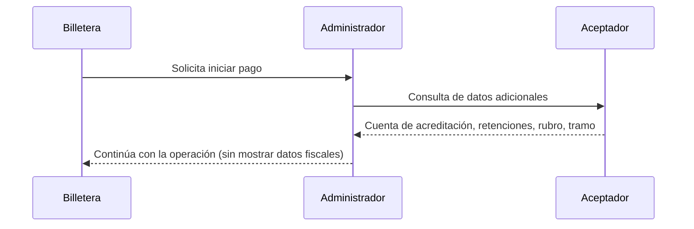

# Consulta de Datos Adicionales al Aceptador
:::info
No olvides que puedes ejecutar nuestra [API Playground](/dlcs/developers/portalApi/pct_for_acquirers) 
:::
La consulta de datos adicionales es una API que el administrador invoca hacia el aceptador para obtener información complementaria sobre una transacción iniciada por una billetera. Esta información **no se muestra al usuario**, sino que se utiliza para aplicar controles internos que determinan correctamente qué se le debe acreditar al comercio.

## ¿Cuándo se invoca?

- Luego de que la billetera escanea un QR y se construye la intención de pago.
- Antes de ejecutar la solicitud de pago, para que el administrador pueda aplicar reglas de acreditación y validación.

## ¿Qué datos puede devolver el aceptador?

- Cuenta de acreditación de comisiones.
- Retenciones y percepciones aplicables (para el aceptador).
- Tramo gratuito o no gratuito.
- Rubro o categoría del comercio.
- Tamaño del comercio (micro, pyme, etc.).
- Códigos internos para trazabilidad.

> ⚠️ Estos datos **no se exponen al usuario final**. Son utilizados exclusivamente por el administrador para determinar el neto a acreditar al aceptador y aplicar reglas de negocio.

## Requisitos técnicos

- El servicio debe estar autenticado vía OAuth 2.0.
- El aceptador debe exponer un endpoint accesible por el administrador.
- El tiempo de respuesta debe ser bajo (ej. 4 segundos).

## Errores comunes

- `AC_QR_NOT_FOUND`: el QR no está registrado o expiró.
- `respuesta nula`: el servicio del aceptador no respondió o devolvió un body vacío.
- Problemas de autenticación: falta de `grant_type=client_credentials` o token inválido.
