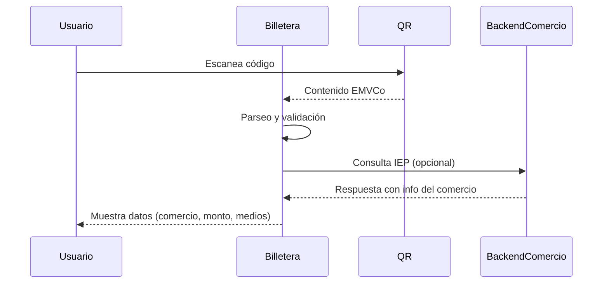

# Escaneo del QR

Cuando el usuario escanea un código QR con su billetera, se inicia el flujo de Pago con Transferencias (PCT). Este QR sigue el estándar EMVCo y contiene información crítica para identificar al comercio y configurar la transacción.

## Contenido del QR

- CVU o alias del comercio
- Monto (opcional)
- Moneda
- ID de transacción
- Datos del adquirente
- Flags de modalidad (PCT, tarjeta)

## Acciones de la billetera

1. Parseo del QR y validación de formato.
2. Consulta al backend del aceptador (si aplica).
3. Presentación de datos al usuario.

