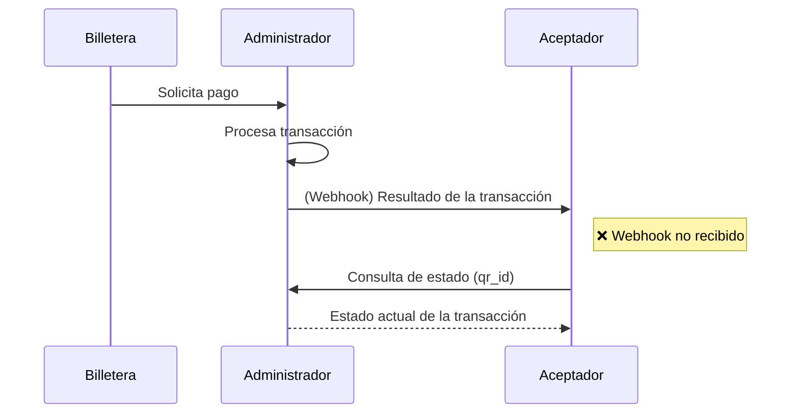

# Consulta de Estado de la Transacción

:::info
No olvides que puedes ejecutar nuestra [API Playground](/doc-acq/developers/portalApi/pct_for_acquirers) 
:::
La consulta de estado es una API que el aceptador puede invocar hacia el administrador para conocer el resultado de una transacción iniciada por una billetera. Este mecanismo actúa como respaldo en caso de que el webhook de notificación no llegue o falle

## ¿Cuándo se utiliza?

- Cuando el aceptador no recibe el webhook de resultado de la transacción.
- Cuando el aceptador necesita reconfirmar el estado de una operación (por ejemplo, por timeout o error de red).
- En procesos de conciliación o auditoría.

## ¿Qué parámetros se utilizan?

- `qr_id`: identificador único del QR escaneado.
- `external_id`: ID de la transacción generado por el aceptador (opcional).
- `fecha`: para acotar la búsqueda si se desconoce el ID exacto.

## ¿Qué devuelve?

- Estado de la transacción: `aprobada`, `rechazada`, `pendiente`, `expirada`.
- Monto, moneda.
- CVU del pagador y receptor.
- Timestamp de ejecución.
- Motivo de rechazo (si aplica).

## Buenas prácticas

- Implementar lógica de reintento con backoff exponencial.
- Registrar todas las consultas para trazabilidad.
- No abusar del endpoint: usar solo cuando el webhook no llega o hay dudas razonables.

