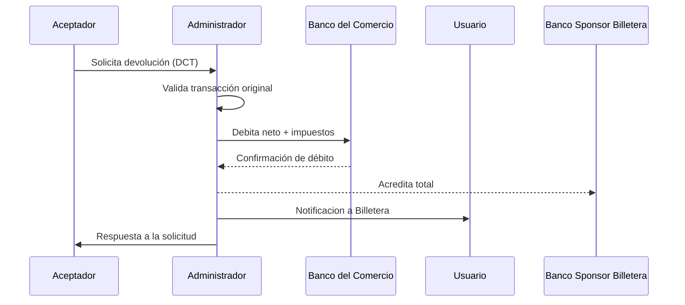

# Devolución (DCT)

:::info
No olvides que puedes ejecutar nuestra [API Playground](/dlcs/developers/portalApi/pct_for_acquirers) 
:::
El servicio de devolución permite al aceptador revertir una operación de pago con transferencia (PCT) previamente aprobada. Esta devolución se realiza mediante una nueva transferencia, denominada DCT, que devuelve el importe al pagador original.

## ¿Cuándo se utiliza?

- Cuando el comercio necesita devolver el importe total o parcial de una operación PCT.
- Por errores operativos, cancelaciones, devoluciones de productos o reclamos.

## ¿Quién lo inicia?

- El aceptador, a través de una API de refund expuesta por el administrador.
- Debe enviar los datos de la transacción original: `qr_id`, `authorization_code`, `monto`, `CBU`, etc.

## ¿Qué hace el administrador?

1. Valida que la transacción original sea válida y esté aprobada.
2. Verifica que el comercio tenga saldo suficiente para cubrir el monto neto + impuestos.
3. Ejecuta la devolución:
   - Debita al comercio el monto neto + impuestos.
   - Reconstruye el monto bruto original.
   - Acredita al usuario el monto bruto.

## ¿Qué pasa si falla?

- Se devuelve un código de rechazo (`BA57`, `AD01`, `B56`, etc.).
- El aceptador puede reintentar o escalar el caso.

