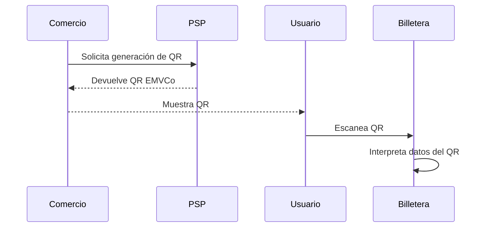

# Generacion de QR

El código QR es generado por el Comercio (o proveedor de servicios) a través de su Aceptador o Adquirente. Este QR es escaneado por el usuario pagador desde su billetera para iniciar el flujo de pago con transferencias (PCT). Este QR sigue el estándar EMVCo y contiene información crítica para identificar al comercio y configurar la transacción.

## ¿Qué contiene el QR?

- CVU o alias del comercio
- Monto (opcional)
- Moneda
- ID de transacción
- Datos del PSP/adquirente
- Flags de modalidad (PCT, tarjeta)
- Información adicional del comercio

## ¿Quién lo genera?

- El aceptador, mediante:
  - POS físico
  - Terminal virtual
  - App de cobro
  - API de integración

## ¿Para quién es?

- Para el usuario pagador, quien lo escanea con su billetera.

