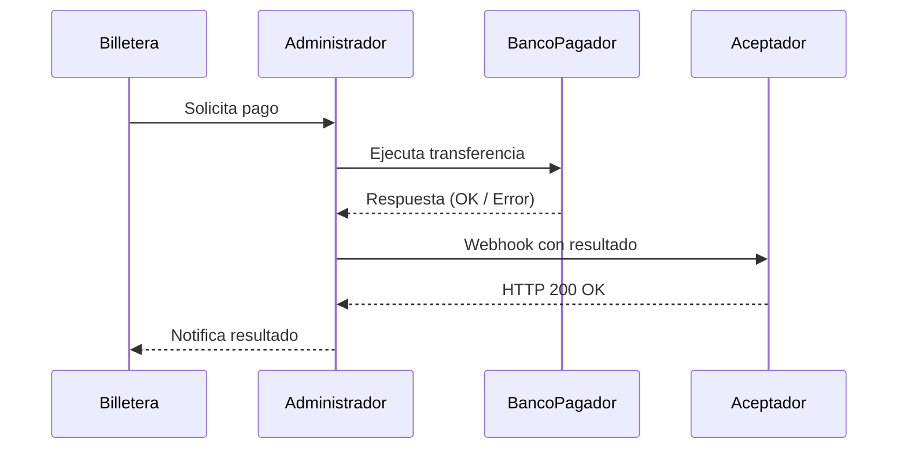

# Notificación al Aceptador (Webhook)

:::info
No olvides que puedes ejecutar nuestra [API Playground](/doc-acq/developers/portalApi/pct_for_newpay) 
:::
Una vez que el administrador procesa una transacción PCT, se emite una notificación al aceptador mediante un webhook. Esta notificación permite al aceptador registrar el resultado de la operación y continuar con su lógica de negocio (por ejemplo, liberar un producto, emitir un ticket, etc.).

## ¿Cuándo se dispara?

- Luego de que el administrador recibe la respuesta del banco del pagador (aprobada o rechazada).
- Antes o en paralelo a la notificación a la billetera.

## ¿Qué contiene la notificación?

- Estado de la transacción (aprobada, rechazada).
- Monto y moneda.
- CVU del pagador.
- CVU del receptor.
- ID de la transacción (correlacionado con el QR).
- Timestamp de ejecución.
- Motivo de rechazo (si aplica).

## ¿Qué debe hacer el aceptador?

- Confirmar recepción con un HTTP 200 OK.
- Procesar la información y actualizar su sistema.
- Registrar el resultado para conciliación.

## ¿Qué pasa si no llega?

- El administrador puede reintentar la notificación (según política).
- El aceptador puede consultar el estado de la transacción vía API.
- Se recomienda implementar lógica de reintento y alertas ante fallos.

## Buenas prácticas

- El endpoint debe estar siempre disponible y tolerante a fallos.
- Registrar todos los eventos recibidos para trazabilidad.
- Validar firma o token si se usa autenticación.
